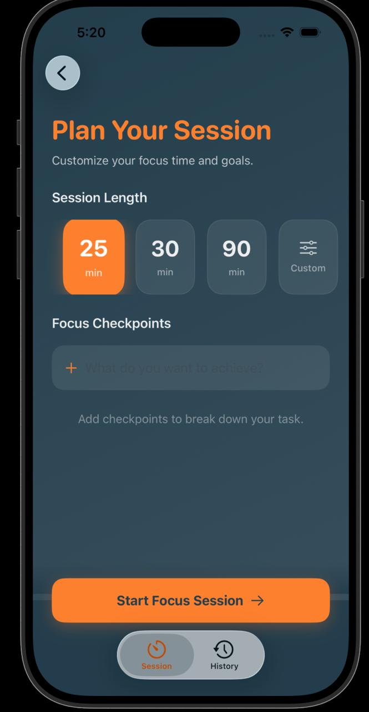
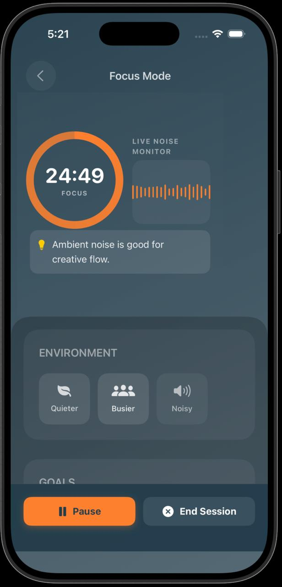
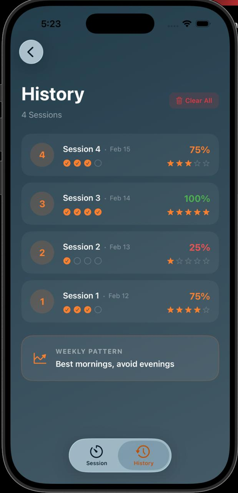
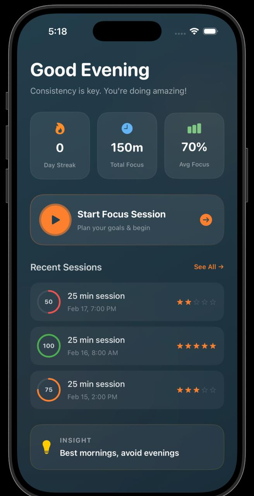

# QuietRadius 🌿

**QuietRadius** is a premium productivity companion designed to help you reclaim your focus in a noisy world. By combining intelligent ambient noise monitoring with a goal-oriented timer, it provides real-time insights into your environment and helps you maintain deep focus.

---

## ✨ Key Features

### 🧭 Plan Your Session

**Plan Your Session:** Intuitive planning with preset durations and goal-oriented checkpoints.

---

### 🎧 Deep Work Mode

**Deep Work Mode:** Immersive timer with live ambient noise monitoring and smart suggestions.

---

### 📊 Track Your Progress

**Track Your Progress:** Comprehensive history tracking with focus effectiveness and rating insights.

---

### 🏠 Clean Home Interface

**Clean UI:** Immersive and clean interface designed for easy navigation.

---

### Additional Capabilities

* **🛡️ Adaptive Noise Monitoring:** Advanced real-time analysis of your environment to detect disruptions and suggest optimizations.
* **⏳ Smart Timer:** Flexible session planning (25, 30, 90 mins) or custom durations tailored to your workflow.
* **✅ Focus Checkpoints:** Break down your main task into actionable goals and track progress dynamically.
* **📈 Insightful Analytics:** Detailed post-session reports featuring average noise levels, effective focus time, and productivity trends.
* **📱 Responsive Design:** Fully optimized for iPhone and iPad with support for both Portrait and Landscape orientations.

---

## 🏗️ Architecture

QuietRadius is built with a modern Swift architecture, prioritizing performance and thread safety:

* **Core Engine:** Leveraging `AVFoundation` for low-latency audio analysis and metering.
* **UI Framework:** Native `SwiftUI` implementation using a state-driven approach for seamless transitions.
* **Concurrency:** Built on Swift's modern concurrency model (`Async/Await`, `Actors`) for responsive background processing.
* **Persistence:** Local data management via `UserDefaults` and `JSON` encoding for session history.

---

## 🚀 Getting Started

1. **Requirements:** iOS 16.0+ | Swift 6.0 | Swift Playgrounds or Xcode
2. **Installation:** Open the `.swiftpm` package in Swift Playgrounds on iPad or Xcode on Mac
3. **Permissions:** The app requires Microphone access to monitor ambient noise levels

---

## 🛠️ Recent Improvements

* **Thread-Safety Calibration:** Enhanced `AudioMonitor` concurrency to ensure crash-free UI updates on newer iOS versions.
* **Arithmetic Robustness:** Implemented safety guards across the timer engine to prevent division errors and ensure accurate progress tracking.

---

## 👤 Author

Created with focus by **Pratham Garg**
